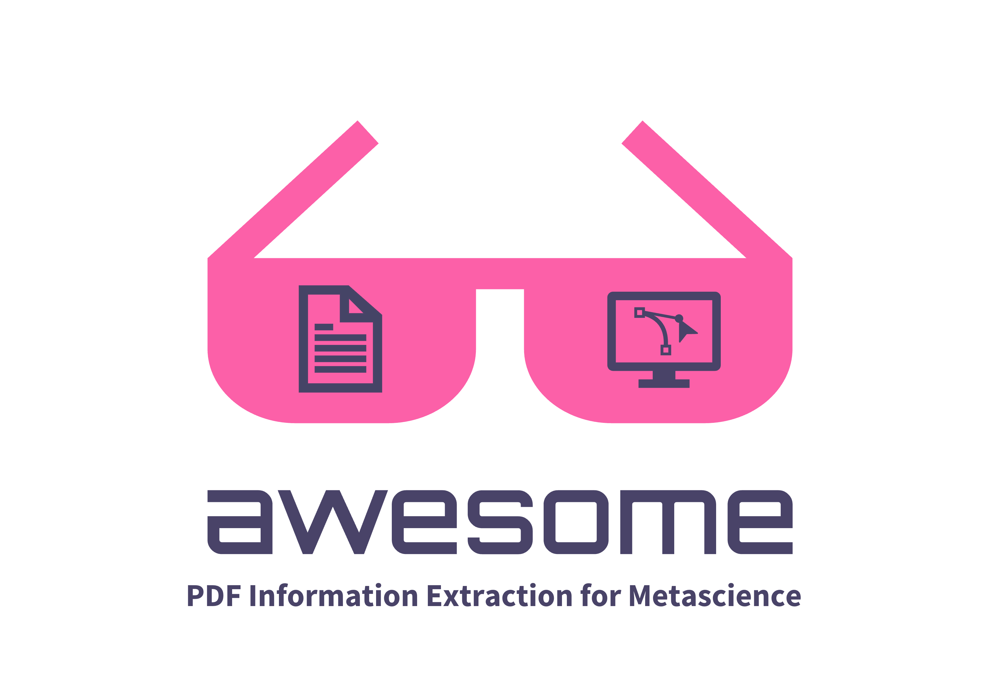

# Awesome PDF Information Extraction for Metascience 

> An [awesome](https://github.com/sindresorhus/awesome) curated list of resources for information extraction from PDFs for metascientific research
> built using the [generator-awesome-list](https://github.com/dar5hak/generator-awesome-list) and inspired by the [*Awesome Computational Social Science* list](https://github.com/gesiscss/awesome-computational-social-science)

Information extraction from academic publications (typically in PDF format) is a key step for many metascientific research projects. This list is meant to keep an up-to-date collection of helpful resources for this task. The order of entries within categories is either alphabetical or chronological.

## Contents

- [Tools](#tools)
- [Tutorials](#tutorials)

## Tools

Tools for extracting information from PDFs. Entries are ordered alphabetically.

- [Docling](https://docling-project.github.io/docling/)
- [GROBID](https://github.com/kermitt2/grobid)
- [Marker](https://github.com/datalab-to/marker)
- [MegaParse](https://github.com/QuivrHQ/MegaParse)

## Tutorials

Tutorials on extracting information from PDFs. Entries are ordered chronologically from most recent to oldest.

- [Turning PDFs into Research Data](https://berd-nfdi.github.io/turning-pdfs-into-research-data.io/)
- [Automatizing Data Extraction for Replicability Analysis using Z-Curve](https://github.com/julianquandt/zcurve_autorep)
- [From PDFs to AI-ready structured data: a deep dive](https://explosion.ai/blog/pdfs-nlp-structured-data)

## Contribute

Contributions welcome! Read the [contribution guidelines](contributing.md) first.
